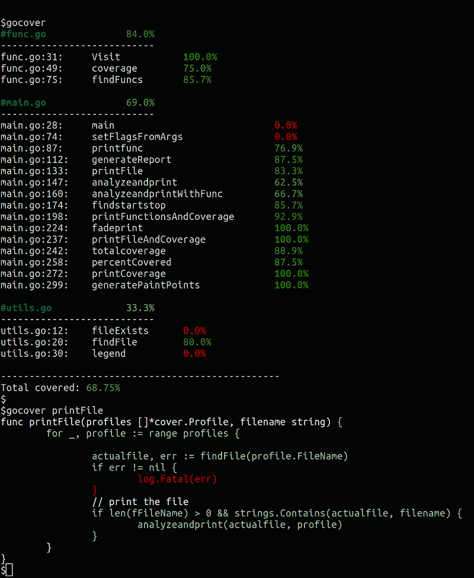

# gocover

Test coverage analysis in your terminal.

## Install

    go get github.com/kjellkvinge/gocover

## Usage

```
usage: gocover [file/function]
```




## Options

```
  -coverFilename string
        Cover profile filename location
  -file string
        show annotated source code for selected file
  -func string
        Show only selected function
  -legend
        Print sample colors
  -runtests
        Run tests and generate coverage profile (default true)
```
